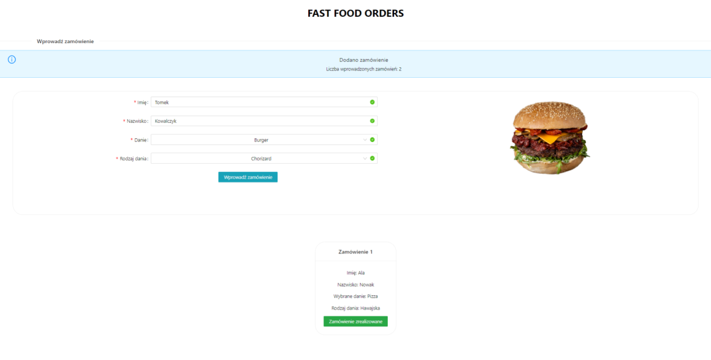

# FAST FOOD ORDERS - React.js web application

## Table of Contents
* [General Information](#general-information)
* [Technologies Used](#technologies-used)
* [Screenshots](#screenshots)
* [Setup](#setup)

## General Information
The web application enables a  

The web application has been created in order to practise and consolidate material concerning basics of React.js as a part of programming course. The requirements which had to be met for the project:
- individual files for CSS style sheets and JS scripts,
- minimum of 3 HTML files and using href attribute which navigates to subpage,   
- using setTimeout() and setInterval() methods,
- styling by classes, tags and id,
- adding of EventListeners in JavaScript,
- communication between HTML pages,
- using the Bootstrap framework.

## Technologies used
- React.js
- Ant Design

## Screenshots

  
  
  

# Setup
- git clone [repository] or download ZIP and unzip this file
- double click on MainPage html file to open a website