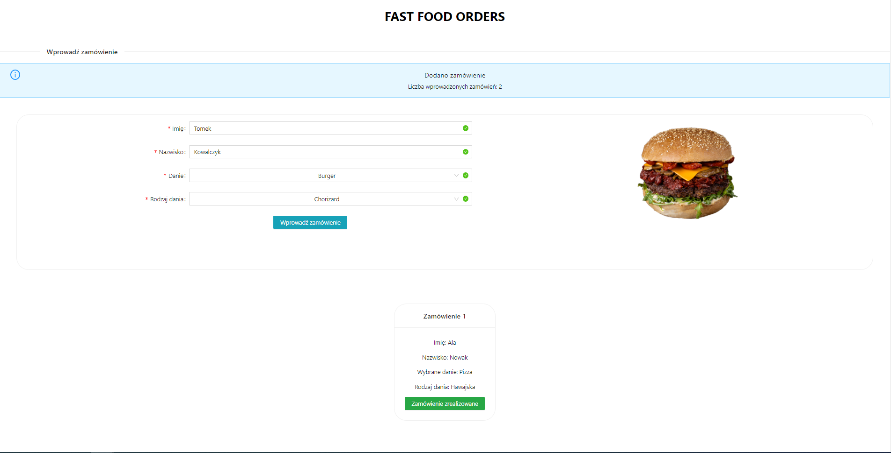
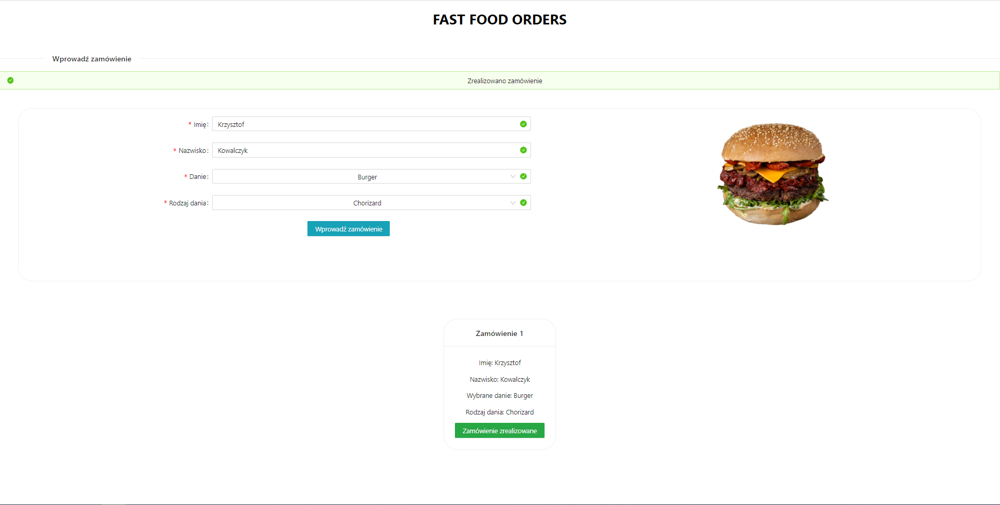

# FAST FOOD ORDERS - React.js web application

## Table of Contents
* [General Information](#general-information)
* [Technologies Used](#technologies-used)
* [Screenshots](#screenshots)
* [Setup](#setup)

## General Information
The program enables adding of orders by entering customer name and surname and specyfing a particular fast food dish. The order can be removed from the list after its fulfilment.

The web application has been created in order to practise and consolidate material concerning basics of React.js as a part of programming course. The requirements which had to be met for the project:
- using <input/> tag and usage of its data in the program in any way,
- using array.map() function for any set of data in order to render each array element,
- usage of useState and useEffect hooks,
- applying of conditional rendering,
- rendering of one component which includes equivalent of hook for component-WillUnmount. The most important is to notice that a component has been unmounted and has been triggered its handler.
- using a library for components (e.g. Ant Design, reactstrap, Semantic UI React).

## Technologies used
- React.js
- Ant Design

## Screenshots

  
  

# Setup
- git clone [repository] or download ZIP and unzip this file
- go to catalog with the project in terminal and trigger `npm install` command
- run a program by `npm start` command